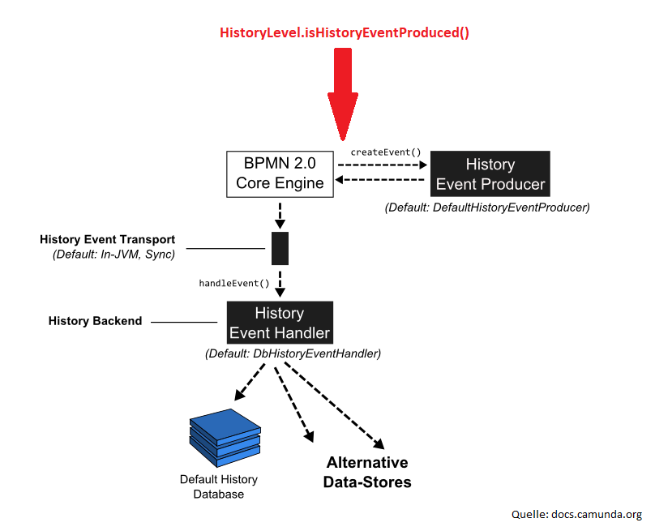
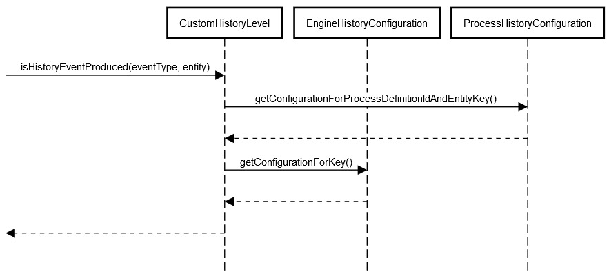
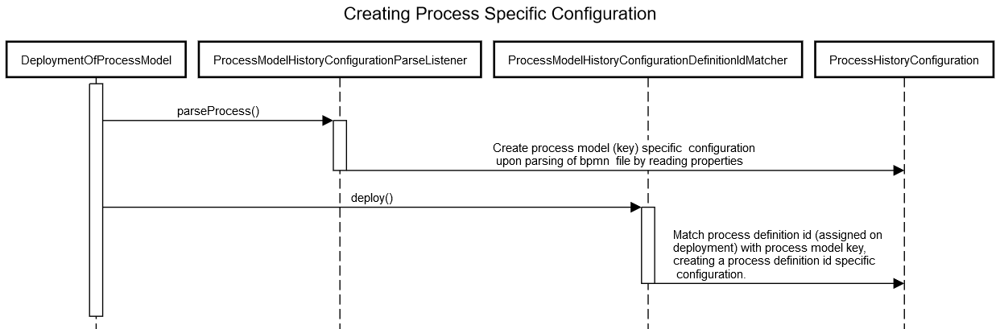

# Custom Camunda History Level Application
Plugin to allow for object-specific configuration of Camunda BPM History on engine oder process-model level 

This project shows a spring-boot-based Camunda BPM application which uses a custom, configurable HistoryLevel. 
This HistoryLevel is object-based and can be configured on engine or on process-model level.

## How to use it?
You may specify the objects that are supposed to be saved to the Camunda History Database in the application.yaml under history.configuration:

```yaml
history:
  configuration:
    process-instance: false 
    activity-instance: true
    task-instance: true
    variable-instance: false
    incident: true
    case-instance: true
    case-activity-instance: true
    decision: true
    external-task: true
    user-operation-log: true
```

This will result in a default, enginewide configuration which will cause the HistoryLevel to include Activity Instances, Incidents etc. but exclude Process Instances, Variable Instances etc.

Additionally, you may specify similar properties in a .bpmn-file, either via xml:

```xml
<bpmn:extensionElements>
  <camunda:properties>
    <camunda:property name="external-task" value="false" />
    <camunda:property name="activity-instance" value="false" />
  </camunda:properties>
</bpmn:extensionElements>
```
or via extension properties in the camunda modeler:

<tr>
  <td></td>
</tr>

Properties that are set this way only apply to processes of the model they were defined in and always overwrite the enginewide configuration. If no configuration is done to an object type on process model level, the HistoryLevel falls back to the enginewide configuration.

## How does it work?
The CustomHistoryPlugin and the ProcessModelHistoryConfigurationParsePlugin extend the AbstractProcessEnginePlugin-interface, causing them to be picked up by the camunda engine when the application context is loaded without further configuration.
The CustomHistoryPlugin introduces the CustomHistoryLevel to the engine, which checks against the configuration whenever a HistoryEvent may possibly be produced. The HistoryLevel acts as a filter not for HistoryEvents, but for the calling of a HistoryEventProducer:

<tr>
  <td></td>
</tr>

If CustomHistoryLevel.isHistoryEventProduced() returns false, the HistoryEventProducer is not invoked an no HistoryEvent is even handled by the HistoryEventHandler.

The CustomHistoryLevel relies on two configurations: the enginewide EngineHistoryConfiguration, and the process specific ProcessHistoryConfiguration. If an entity would create a HistoryEvent based on an entity, the HistoryLevel checks those configurations, with the ProcessHistoryConfiguration having priority:

<tr>
  <td></td>
</tr>


Since the process definitions can only be identified by the process definition id, which is set upon deployment, but the history configuration properties need to be extracted upon parsing, the ProcessModelHistoryConfigurationParsePlugin registers two components: the ProcessModelHistoryConfigurationParseListener reads the properties upon parsing and deposits them with the process definition key, the ProcessModelHistoryConfigurationDefinitionIdMatcher the matches this key with the generated id upon deployment:

<tr>
  <td></td>
</tr>


## Environment Restrictions
Built and tested against Camunda BPM version 7.10.0.


## Known Limitations
Does not allow process-model or definition-model specific filtering of decisions. This filter may only be applied on engine level. 


## License
[Apache License, Version 2.0](http://www.apache.org/licenses/LICENSE-2.0).